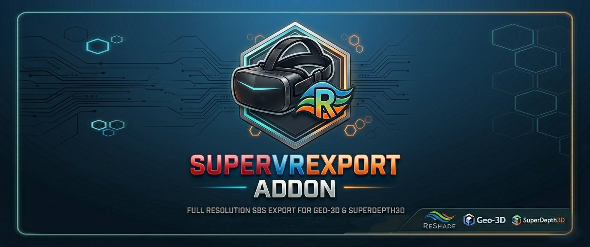

<div align="center">



[](https://reshade.me)
[](#)
[](LICENSE)

**A ReShade addon that exports SuperDepth3D's stereoscopic output directly to KatanaVR / VRScreenCap at full resolution with zero intermediate capture.**

</div>

---

## 🙏 Credits

| | |
|---|---|
| **[artumino](https://github.com/artumino/ReshadeVRExport)** | Original ReshadeVRExport — architecture, shared-texture pipeline, and Geo3D support that this project is built on |
| **[BlueSkyDefender](https://github.com/BlueSkyDefender/Depth3D)** | Author of SuperDepth3D and the Frame Alternation / DoubleBuffer additions that make the direct export pipeline possible |

---

## 💡 What It Does

SuperVrExport hooks into ReShade's effect pipeline and shares the stereo 3D frame with KatanaVR or VRScreenCap every frame via a cross-process DXGI shared texture — no screen capture, no resolution loss, no latency beyond one frame.

The addon **automatically configures SuperDepth3D** on startup: it sets the required preprocessors and output mode. You do not need to change any shader settings manually.

---

## 🎮 How It Works — SuperDepth3D Pipeline

```
SuperDepth3D (Frame Sequential mode, set automatically)
        │  alternating L/R full-frame output each frame
        ▼
3DToElse.fx (Frame Sequential input, set by user once)
        │  reconstructs current + previous frame into full SBS (texTOT)
        ▼
SuperVrExport addon
        │  copies texTOT to a shared GPU texture each frame
        ▼
KatangaMappedFile  ←  KatanaVR / VRScreenCap reads this handle
        │
        ▼
 KatanaVR  →  VR headset (full resolution SBS)
```

### What the addon sets automatically

| Preprocessor / Uniform | Value | Why |
|---|---|---|
| `EX_DLP_FS_Mode` | `1` | Adds Frame Sequential (mode 6) to SuperDepth3D's Stereoscopic Mode dropdown |
| `DoubleBuffer_Mode` | `1` | Creates the DoubleTex buffer as a direct SBS source |
| `Stereoscopic_Mode` | `6` (Frame Sequential) | Set automatically after compile |
| `FS_FA` | `true` | Enables addon-driven frame alternation |

---

## 📦 Requirements

| Component | Version / Notes |
|---|---|
| **ReShade** | 6.3.x or newer, installed in **DXGI proxy mode** (`dxgi.dll`) for D3D12 games |
| **SuperDepth3D.fx** | v5.3.8 or newer — must include `EX_DLP_FS_Mode` and `DoubleBuffer_Mode` preprocessors |
| **3DToElse.fx** | Required. Included in the `Effects/` folder |
| **KatanaVR / VRScreenCap** | 0.4.0-dev5 or newer. Must be started **after** the game |
| **OS** | Windows 10 2004+ or Windows 11 |

---

## 🚀 Setup

### 1 — Install ReShade

Download [ReShade](https://reshade.me) and install it for your game selecting the **DXGI** API. This places `dxgi.dll` next to the game executable.

### 2 — Copy shader files

Copy **`SuperDepth3D.fx`** (v5.3.8+) and **`3DToElse.fx`** into your `reshade-shaders\Shaders\` folder and enable both techniques in the ReShade overlay.

> **Technique order matters:** `SuperDepth3D` must appear **before** `To_Else` in the technique list.

### 3 — Install the addon

Copy **`SuperVrExport.addon64`** to the same folder as `dxgi.dll`. ReShade automatically loads all `.addon64` files from that directory.

### 4 — Configure 3DToElse

Open the ReShade overlay, select the **To_Else** technique, and set:

| Setting | Value |
|---|---|
| **Stereoscopic Mode Input** | **Frame Sequential** (index 5) |
| **3D Display Mode** | **Side by Side** (index 0) |

> The addon automatically sets SuperDepth3D to Frame Sequential mode — you only need to configure the 3DToElse input side.

### 5 — Launch the game

Start the game. Within 2–3 seconds the addon will set the required preprocessors (triggering a one-time shader recompile), configure Frame Sequential mode, and write the shared handle to `KatangaMappedFile`.

### 6 — Start KatanaVR / VRScreenCap

Launch the viewer **after** the game has loaded. It reads `KatangaMappedFile` and opens the shared texture automatically.

> If the viewer was already running before the game, restart it after the game loads.

---

## 🌐 Geo3D / Frame Sequential Games

For games that natively output frame sequential stereo (e.g. Geo-3D titles):

1. Enable **3DToElse.fx** in ReShade
2. Set **Stereoscopic Mode Input = Frame Sequential**
3. The addon reads `texTOT` from 3DToElse — no SuperDepth3D required
4. Start KatanaVR after the game

---

## 🔧 Troubleshooting

| Symptom | Fix |
|---|---|
| KatanaVR shows nothing | Restart KatanaVR **after** the game loads. Check `ReShade.log` for `D3D12 ready` |
| Black screen in headset | Confirm `first copy fired` in `ReShade.log`. Restart KatanaVR |
| Addon not in ReShade list | Ensure `.addon64` is next to `dxgi.dll`; reinstall ReShade with "Install add-ons" checked |
| `DoubleTex not found` loop | Normal on first launch — resolves within 3 seconds |
| Virtual controller freeze | Wait 2 seconds — reload guard prevents infinite loop |

### Reading ReShade.log

| Message | Meaning |
|---|---|
| `D3D12 ready (D3D11 bridge, ...)` | Bridge established — start KatanaVR now |
| `first copy fired, src=... dst=...` | GPU copy is working |
| `VR buffer not found` | texTOT temporarily unavailable during reload — resolves automatically |
| `DoubleTex not found — forcing reload` | Normal on startup, triggers one shader recompile |

---

## 🏗️ Building

Requires Visual Studio 2019 or 2022 with the C++ Desktop workload.

```bat
build.bat
```

Downloads ReShade headers automatically and produces:

```
bin\x86_api14\SuperVrExport.addon    ← x86, ReShade 6.3.x
bin\x64_api14\SuperVrExport.addon64  ← x64, ReShade 6.3.x
bin\x86_api16\SuperVrExport.addon    ← x86, ReShade 6.4+
bin\x64_api16\SuperVrExport.addon64  ← x64, ReShade 6.4+
```

---

<div align="center">

Original addon by **[artumino](https://github.com/artumino/ReshadeVRExport)** · SuperDepth3D by **[BlueSkyDefender](https://github.com/BlueSkyDefender/Depth3D)**

</div>
